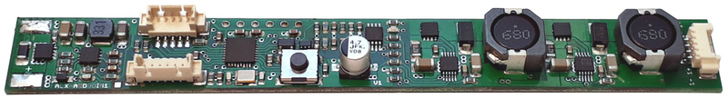

# ALX-ARDUDIM-CC Library
__Aruduino Compatible Constant Current LED Driver__

Arduino library and example code for the ALX-ARDUDIM-CC LED driver.

## Dependencies
For basic functionality, a recent Arduino IDE with standard libraries is
sufficient.
In order to build the factory firmware two additional libraries are required:
- [OneButton](https://github.com/mathertel/OneButton)
- [Seeed QTouch](https://github.com/Seeed-Studio/Seeed_QTouch)
